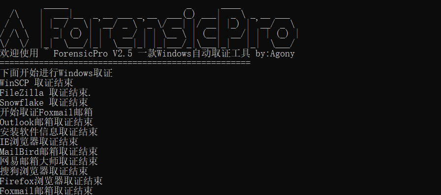
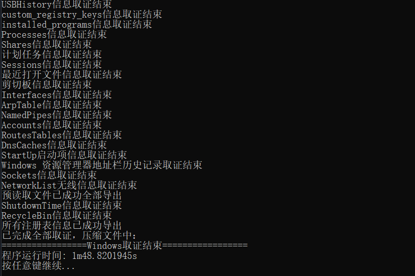

# ForensicPro - 一款Windows自动取证工具
 

## 介绍

基于Golang实现的一款Windows自动取证工具，如果对你有帮助的话，不妨点个star🐟，main主分支是完全版，dev是精简版（去除了通讯工具取证和常用软件取证）。

　　取证内容包括：

　　1．     浏览器取证

　　2．     FTP工具取证

　　3．     邮箱工具取证

　　4．     通讯工具取证

　　5．     常用软件取证

　　6．     系统信息取证，包括启动项、计划任务、systeminfo、注册表、硬件信息等等。。。


## 编译

GitHub直接clone源码：

```
git clone https://github.com/AgonySec/ForensicPro.git
```

编译：

```
go build -ldflags="-w -s" -o ForensicPro.exe -trimpath .\cmd\forensicpro\main.go
```

如果你不想编译，也可以直接去[release](https://github.com/AgonySec/ForensicPro/releases)页面下载已经打包好的EXE，下载最新版即可

## 快速使用

　　管理员方式运行ForensicPro.exe即可，也可以在管理员命令行窗口运行，无需联网，运行结束之后会生成一个ForensicPro_result.zip，取证结果都保存在里面压缩包中





## 注意

开发环境：

- go 1.20.1
- Windows 11

主要是预读取文件文件夹和win日志文件夹需要管理员权限，其他功能倒也不需要管理员权限

## 许可证

　　本项目采用 [MIT License](LICENSE) 许可证。
