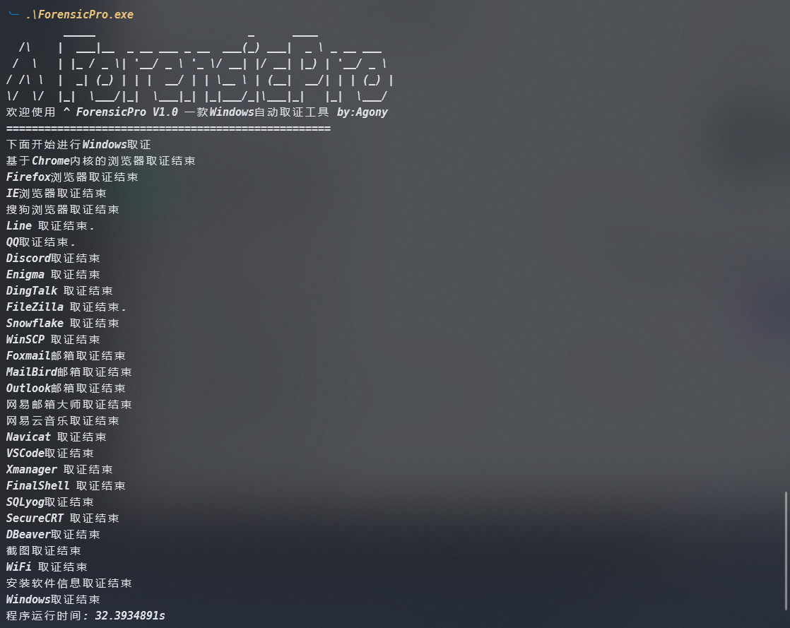

# ForensicPro - 一款Windows自动取证工具

## 介绍

　　Windows自动取证工具，内容包括：

　　1．     完成浏览器取证功能，包括基于谷歌内核大部分浏览器、FireFox浏览器、IE浏览器、搜狗浏览器

　　2．     完成FTP工具取证功能，包括FileZilla、Snowflake、WinSCP

　　3．     完成邮箱工具取证功能，包括Foxmail、MailBird、网易邮箱大师、outlook

　　4．     完成通讯工具取证功能，包括 钉钉、Discord、Enigma、Line、QQ、Skype、Telegram

　　5．     完成常用软件取证功能，包括 DBeaver、FinalShell、Navicat、NeteaseCloudMusic、SecureCRT、SQLyog、VSCode、Xmanager

　　6．     完成系统信息取证功能，包括WIFI、安装软件目录、截屏

## 使用

　　双击可执行文件exe运行即可，也可以在命令行窗口运行，无需管理员权限，运行结束之后会生成一个ForensicPro_result.zip，取证结果都保存在里面

​​

　　‍

## 贡献

　　欢迎对本项目进行贡献。如果您发现任何问题或有新功能的建议，请通过 GitHub Issues 提交。

## 许可证

　　本项目采用 [MIT License](LICENSE) 许可证。
