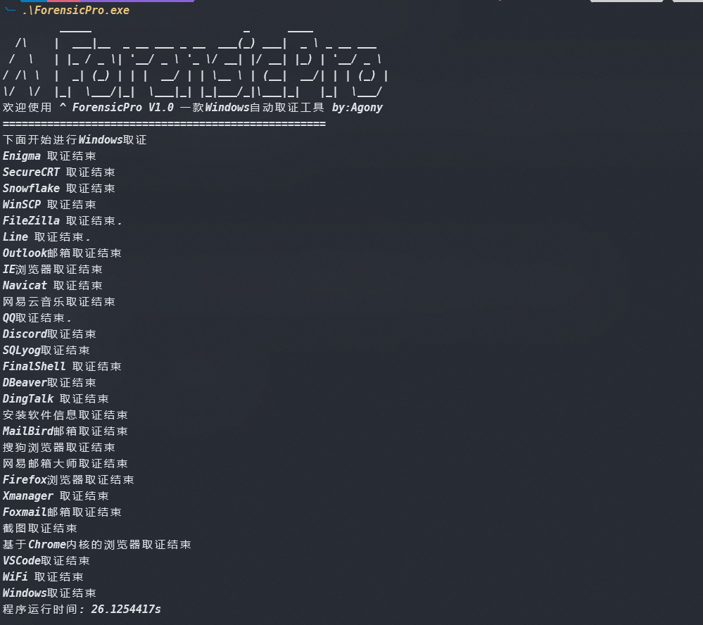

# ForensicPro - 一款Windows自动取证工具

## 介绍

　　Windows自动取证工具，内容包括：

　　1．     浏览器取证

　　2．     FTP工具取证

　　3．     邮箱工具取证

　　4．     通讯工具取证

　　5．     常用软件取证

　　6．     系统信息取证，包括WIFI、安装软件目录、截屏、systeminfo、注册表等等

## 使用

　　双击可执行文件ForensicPro.exe运行即可，也可以在命令行窗口运行，无需管理员权限，无需联网，运行结束之后会生成一个ForensicPro_result.zip，取证结果都保存在里面

　　‍

## 许可证

　　本项目采用 [MIT License](LICENSE) 许可证。
